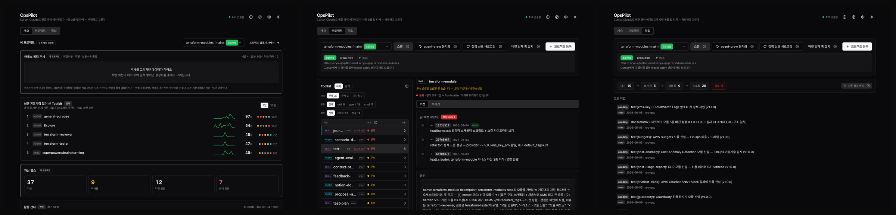
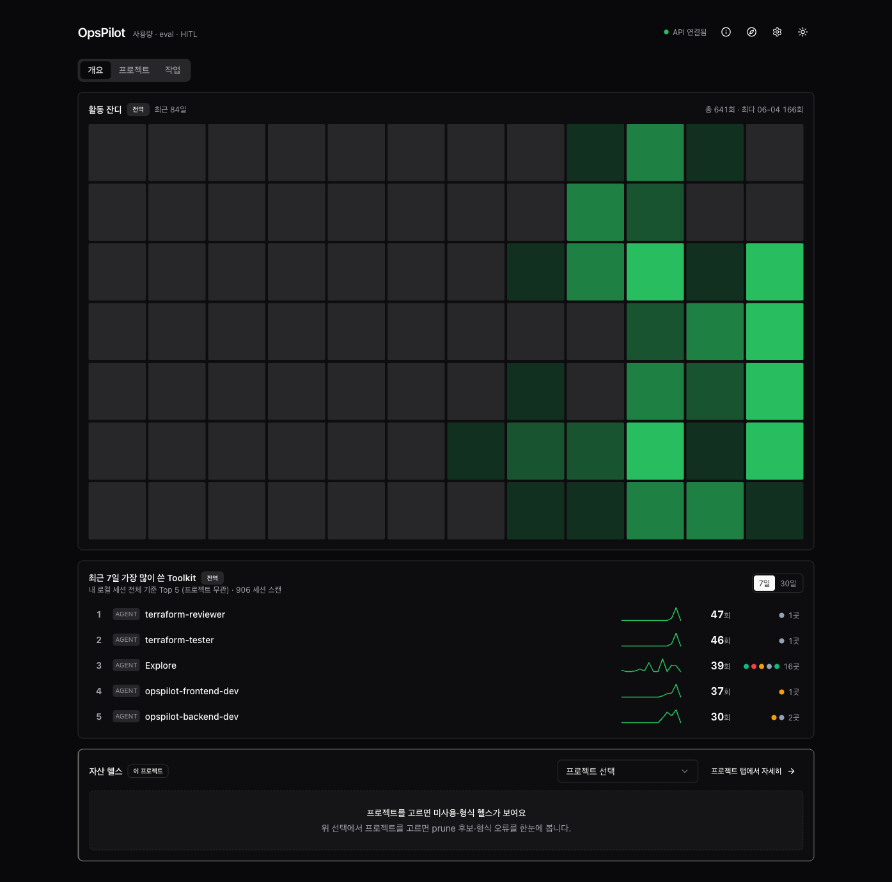
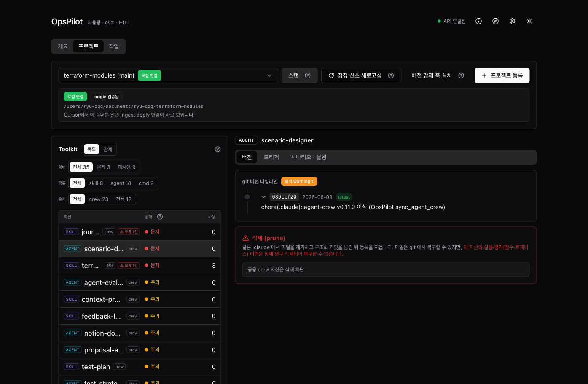
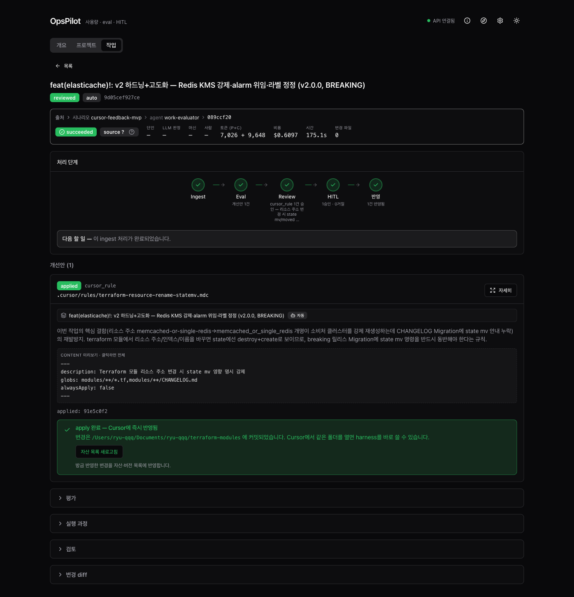

# OpsPilot

Cursor랑 Claude로 만든 규칙·에이전트가 진짜 사람 손을 덜 타게 됐는지를, 느낌이 아니라 추세로 보는 로컬 도구입니다. 작업 기록에서 얼마나 손이 덜 갔는지 재고, 고칠 거리를 뽑아서, 규칙·에이전트에 도로 반영하는 한 바퀴를 돕니다.

## 왜 만들었나

하네스(에이전트·스킬·커맨드)를 깔면 생산성은 분명 올라갑니다. 그런데 그 하네스가 정작 제대로 작동하는지 평가할 기준이 없었습니다. 이걸 평가할 수 있을까? 할 수 있다면 어떻게 최대한 편하게 해볼 수 있을까? — 이 질문에서 시작했고, 그래서 만들어서 써보고 있습니다.



할 수 있는 건 대강 이렇습니다.

- 에이전트·스킬·커맨드를 만들고 버전을 매깁니다.
- 실제 작업을 격리된 환경에서 돌려보고, 잘했는지 점수로 평가합니다.
- 같은 자산의 여러 버전을 나란히 비교해서 제일 나은 걸 고릅니다.
- Cursor나 Claude로 한 작업을 자동으로 평가받고, 개선안을 받아 자산에 반영합니다.

## 내 하네스 건강도 챙기기

써보고 싶은 프로젝트를 등록하면 그 안 `.claude` 의 자산이 자동으로 등록됩니다.

개요에서 자산을 최근 7일·30일 동안 얼마나 썼는지 볼 수 있습니다. 자주 쓰는 자산일수록 잘 다듬어 둘 값어치가 크고, 아예 안 쓰는 자산은 삭제 후보입니다.



프로젝트 화면에서는 프로젝트별로 자산을 목록으로 볼 수 있고, 자산을 클릭하면 버전 타임라인·시나리오 실행 같은 상세 기능을 쓸 수 있습니다.



작업 화면에서는 자산이 제대로 작동하는지 평가할 수 있습니다. 직접 시나리오로 점수를 매기거나, 자동으로 굴려놓고 나중에 트레이스로 되짚거나, 작업하며 "이건 이렇게 해줘" 고쳐 나온 결과를 바로 평가할 수 있습니다. 작업을 열면 판정과 개선안이 먼저 보이고, 트레이스·검토·변경 diff는 필요할 때 펼쳐 볼 수 있습니다.



## 시작하기

```bash
./scripts/bootstrap.sh
```

한 줄이면 아래가 멱등하게(이미 된 건 건너뛰고) 끝납니다.

- 전제조건 점검 — Node 20+, corepack, 로컬 `claude` CLI. CLI가 없으면 러너·MCP·초안 생성이 안 도니 참고하세요.
- 의존성 설치 — `corepack pnpm install`. DB는 `better-sqlite3`, 로컬 SQLite 파일 하나를 씁니다.
- DB 마이그레이션 — 스키마를 잡습니다. 기존 영속 DB가 있으면 먼저 백업합니다.
- 서버(:3001)·웹(:5173) 기동.
- MCP 등록 — `claude mcp add`. 이후 Claude Code 세션에서 OpsPilot 툴을 호출할 수 있습니다.

띄우고 나면 `http://localhost:5173` 을 열고 헤더의 나침반(가이드 투어)을 켜면 됩니다. 프로젝트 등록부터 개선안 결정까지 따라가며 짚어줍니다.

## 더 자세히

내 프로젝트에 공통 하네스를 입히는 법, 등록 두 모드(로컬 연결·관리 클론), MCP 툴 목록은 [온보딩 가이드](docs/consumer-onboarding.md)에 정리해뒀습니다.

## 스택

pnpm 모노레포입니다. Node 20 이상, `corepack pnpm` 을 씁니다.

| 워크스페이스 | 기술 |
| --- | --- |
| `apps/web` | Vite · React · TypeScript · TanStack Query · shadcn/ui · Tailwind · React Flow |
| `apps/server` | Fastify · TypeScript · better-sqlite3 |
| `packages/*` | 공유 ESLint/TS 설정 · Zod 스키마 |

코드 규칙은 [CONVENTIONS.md](./CONVENTIONS.md), 데이터 모델은 [docs/DATA_MODEL.md](./docs/DATA_MODEL.md)에 있습니다.

## Todo

- [ ] 검증한 버전을 다른 프로젝트로 이식 — 지금은 같은 자산 안에서 버전 올리기까지입니다.
- [ ] 사람 점수·회고를 "이렇게 고쳐봐" 추천으로 되먹이기 — 지금은 쌓기만 합니다.
- [ ] npm 한 줄 설치 — 지금은 레포를 클론해서 직접 띄웁니다.
- [ ] Agent SDK·클라우드 실행 — 지금은 로컬 Claude Code 환경만 봅니다.
