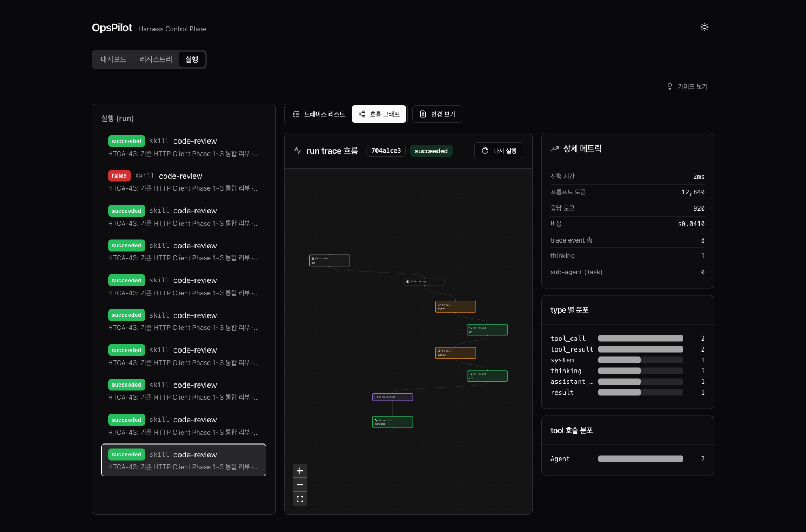
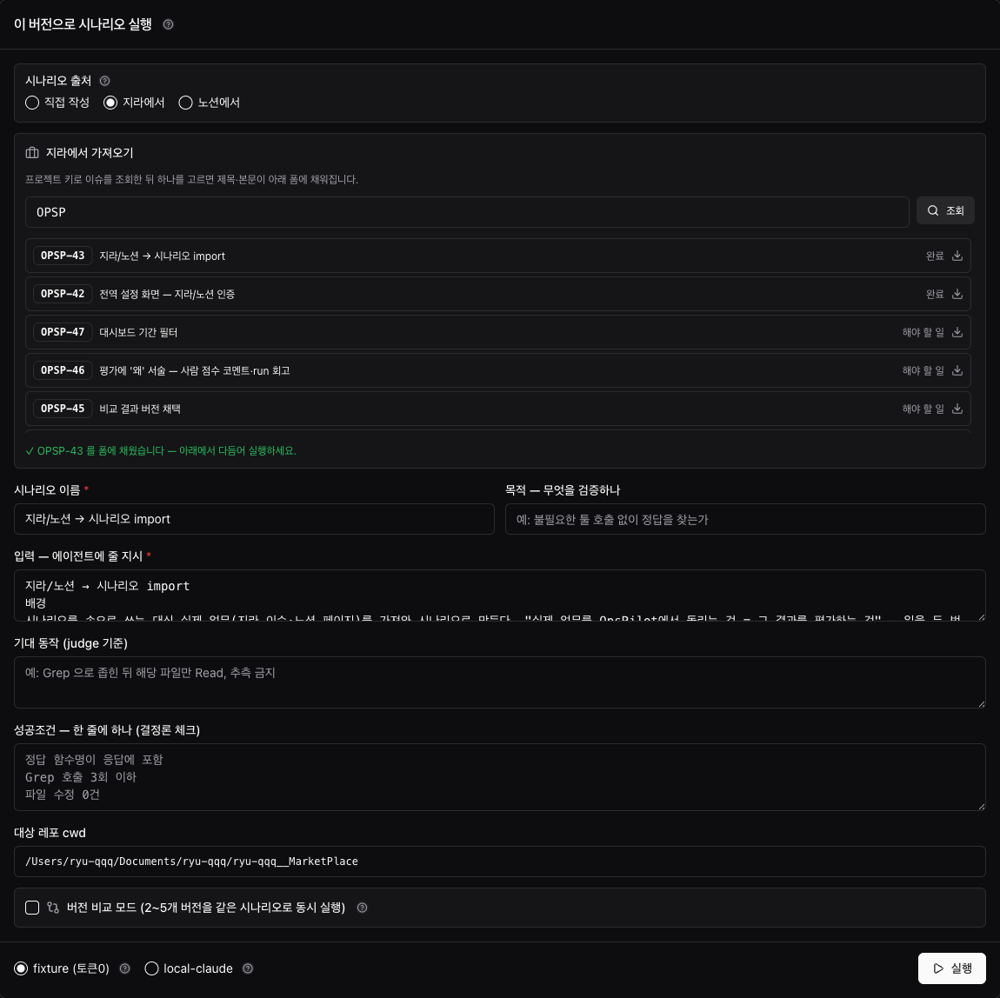
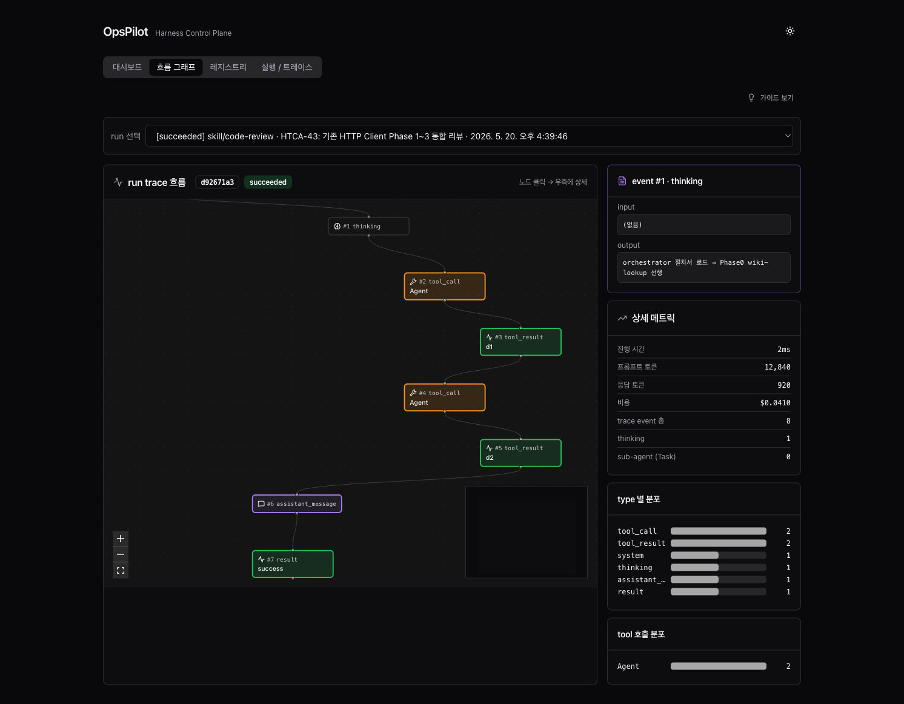
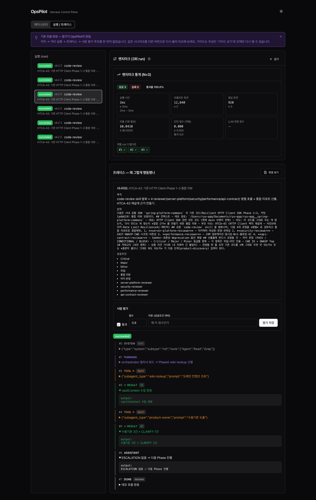
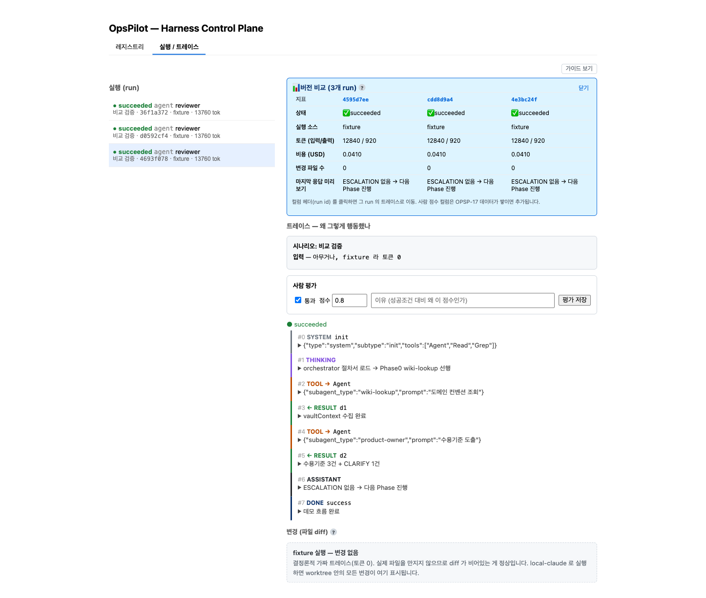
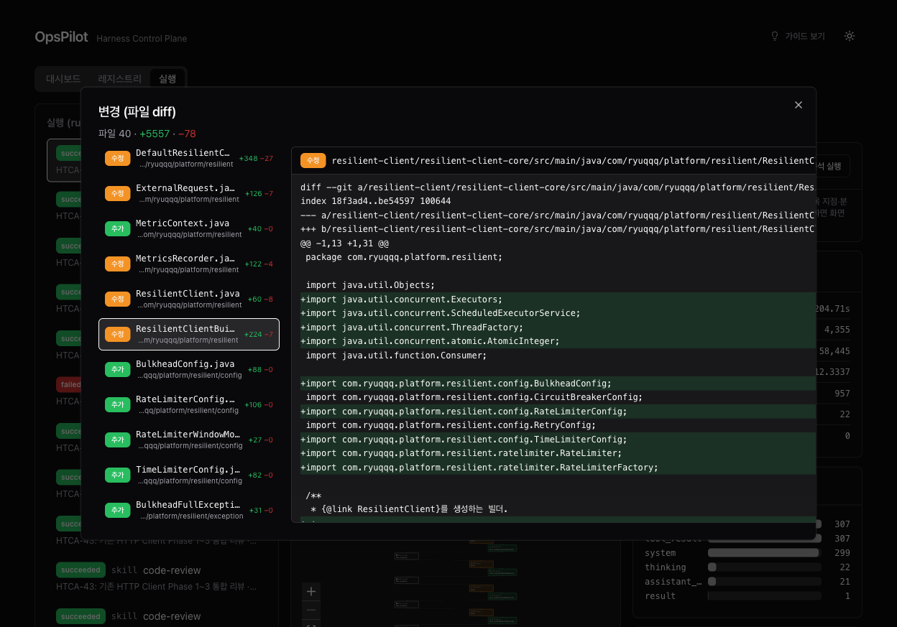

# OpsPilot — Harness Control Plane

> Claude Code 에이전트·스킬·커맨드를 **저작 · 버저닝 · 격리 실행 · 평가 · 채택**하는 로컬 컨트롤 플레인.

내가 만든 에이전트가 *정말 의도대로, 일관되게* 작동하는지 — 느낌이 아니라 트레이스와 점수로 빠르게 판단하기 위한 도구.



---

## 왜 만들었나

조직 위키 *「Software 3.0 시대, Harness를 통한 조직 생산성 저점 높이기」* 는 에이전트·스킬·커맨드를 플러그인으로 배포하면 팀 생산성의 저점이 올라간다고 주장한다. 그러나 그 선언문은 두 가지를 **미구현 과제로 남겼다**:

- 플러그인 리뷰 / 버저닝 / 배포 프로세스
- 토큰 효율·에이전트 정확도 모니터링 체계

"자산을 배포하라"고 했지만, *그 자산이 제대로 작동하는지 판단할 도구* 가 빠져 있었다. **OpsPilot은 그 빠진 컨트롤 플레인이다** — 선언(위키) → 지라 체계화(에픽 OPSP-14) → 구현으로 이어지는 프로젝트.

## 핵심 개념 — 닫힌 루프

보통 에이전트/스킬을 만들 때, 잘 작동하는지는 "느낌"으로 판단하고, 프롬프트를 고치면 이전 버전과 무엇이 달라졌는지 알 수 없다. OpsPilot은 이 루프를 닫는다:

```
저작 → 버저닝 → 격리 실행 → 평가 → 채택
```

1. **저작** — 폼으로 에이전트/스킬/커맨드를 작성. 컨셉 한 줄만 주면 AI가 초안(트리거·도구·본문)을 채운다.
2. **버저닝** — 저장하면 OpsPilot이 *구조화 커밋* 을 강제한다. git 커밋 하나 = 버전 하나.
3. **격리 실행** — 버전을 일회용 git worktree에서 실행. 클론·원본 레포는 건드리지 않는다.
4. **평가** — 시나리오 성공조건 자동 채점 / 사람 점수·회고 메모 / LLM 판정 / 버전 비교 / 벤치마크.
5. **채택** — 비교·벤치마크로 가린 버전을 자산의 현재 버전으로 "앞으로 감기"(구조화 커밋).

## 핵심 설계

OpsPilot을 단순 로그 뷰어와 다르게 만드는 네 가지 결정:

| 설계 | 내용 |
|---|---|
| **git 커밋 = 버전의 단일 원천** | 별도 버전 DB가 없다. 프로젝트는 **로컬 경로 연결** 또는 **git URL 클론**으로 등록하고, 자산 변경은 OpsPilot이 구조화 커밋으로 강제한다 — git 히스토리가 곧 버전 히스토리. |
| **worktree 격리 실행** | 실행은 버전 커밋으로 만든 일회용 git worktree에서 일어나고, 끝나면 폐기된다. 클론·원본 레포는 오염되지 않는다. |
| **비동기 러너** | 실행 요청은 즉시 반환되고 백그라운드에서 진행되며 프론트가 폴링한다. 수 분~수십 분 걸리는 실행도 화면을 막지 않는다. |
| **로컬 `claude` CLI 직접 실행** | 별도 API 키·과금 없이 로컬 `claude` 헤드리스를 spawn한다(키체인 인증 직결). 글로벌 MCP는 차단해 실행의 재현성을 확보한다. |

## 기능

### 레지스트리 — 프로젝트 · 자산 · 버전

git URL로 **관리 클론** 등록(또는 **로컬 경로 연결**) → 스캔하면 `.claude/` 의 에이전트·스킬·커맨드가 자산으로 등록된다. 각 자산은 git 커밋 기반의 버전 타임라인을 갖는다. 자산은 폼으로 직접 저작할 수 있고(컨셉 한 줄 → AI 초안 자동완성, Claude Code 공식 frontmatter 스펙 반영), 저장 시 버저닝 커밋이 강제된다. 에이전트가 49개든, 한 레포를 **중앙 에이전트 라이브러리** 로 삼아 통째로 관리할 수 있다.

### 실제 업무를 시나리오로 — 지라 · 노션 import

합성 시나리오 대신 실제 업무를 가져온다. 헤더의 설정에 지라/노션 토큰을 넣으면, 실행 폼에서 지라 이슈·노션 페이지를 골라 시나리오로 채운다 — 제목이 이름, 본문이 입력. "실제 업무를 OpsPilot에서 돌리는 것 = 그 결과를 평가하는 것", 일을 두 번 하지 않는다.



### 실행 + 트레이스 관측

버전과 시나리오를 골라 격리 worktree에서 실행한다. 결정론적 `fixture`(토큰 0) 또는 실제 `local-claude` 두 모드. 실행 트레이스는 단계별 리스트와 흐름 그래프 두 가지로 관측할 수 있다 — 에이전트가 어떤 도구를 왜 호출했는지, 어디서 하위 에이전트에 위임했는지가 그래프로 드러난다.



### 평가 — 4대 축 + α

1. **회귀 테스트** — 시나리오 셋으로 통과/실패 자동 채점
2. **실행 트레이스 관측** — 도구 호출·판단·토큰의 단계별 시각화
3. **버전 A·B diff** — 같은 시나리오로 여러 버전을 동시 실행해 행동을 나란히 비교
4. **LLM-as-judge** — 정답이 없는 작업을 기준 기반으로 채점

여기에 **벤치마크**(같은 버전×시나리오를 N회 반복 → 통과율·표준편차로 *일관성* 측정), **사람 스코어링**, **회고 메모**(점수 외에 "왜" 를 자유 서술 — 숫자가 지식이 되게)가 더해진다.



### 버전 비교와 채택

한 자산의 여러 버전을 같은 시나리오로 동시 실행해 컬럼별로 나란히 비교하고, 우승(또는 임의) 버전을 **「이 버전 채택」** 으로 자산의 현재 버전으로 만든다 — git 선형 모델의 "앞으로 감기". 채택 근거가 커밋 메시지에 남는다.



### 변경 diff

격리 worktree에서 에이전트가 실제로 만진 파일을 diff로 보여준다 — 2-pane 마스터/디테일로, 파일 목록과 patch를 동시에.



### Claude Code 에서 호출 — MCP 어댑터

OpsPilot 데이몬을 한 터미널에 띄워두고, 다른 터미널의 Claude Code 세션에서 자연어로 트리거할 수 있다. 데이몬의 `:3001/mcp` 엔드포인트가 MCP HTTP 어댑터로 동작해 `register_project` · `scan_project` · `list_projects` 등 13개 툴을 노출한다. 자세한 표는 아래 [Claude Code 에 등록](#claude-code-에-등록-mcp) 참고.

### 그 외

- **AI 트레이스 분석** — 긴 실행 트레이스를 AI가 요약·해설(비동기, 결과는 캐시)
- **관측 대시보드** — 전체 현황·통과율·진행 중 run·평균 토큰/비용(기간 필터 7일/30일/전체)
- **온보딩 가이드 · 다크 모드 · 다음 스텝 시각 안내**
- **데이몬 pane 컬러 한 줄 로그** — 핵심 이벤트(서버 시작 · run 시작/종료 · scan · MCP 호출)만 정돈된 한 줄로 출력. `OPS_TERM_LOG=off` 로 끔.

## 스택

pnpm workspace 모노레포:

| 워크스페이스 | 스택 |
|---|---|
| `apps/web` | Vite + React + TypeScript — TanStack Query, shadcn/ui + Tailwind, React Flow |
| `apps/server` | Fastify + TypeScript + better-sqlite3 |
| `packages/config` · `packages/shared-types` | 공유 ESLint/TS 설정, 공유 Zod 스키마 |

- **러너** — 로컬 `claude` CLI 헤드리스 spawn (별도 키·과금 없음)
- **런타임** — Node ≥ 20, `corepack pnpm`

코드 컨벤션은 [`CONVENTIONS.md`](./CONVENTIONS.md)(토스 Frontend Fundamentals 4원칙 기반), 데이터 모델은 [`docs/DATA_MODEL.md`](./docs/DATA_MODEL.md). 작업 추적은 지라 `OPSP`.

## 실행

전제: Node ≥ 20, `corepack`(pnpm).

```bash
corepack pnpm install

# 백엔드 — 터미널 A
cd apps/server
corepack pnpm db:migrate     # SQLite 스키마 생성
corepack pnpm dev            # → http://localhost:3001

# 프론트 — 터미널 B
cd apps/web
corepack pnpm dev            # → http://localhost:5173
```

브라우저로 `http://localhost:5173` 접속 → 아래 [5분 시작 — Cursor 피드백 루프](#5분-시작--cursor-피드백-루프) 참고.

> **참고** — 루트 `pnpm dev` 는 두 워크스페이스를 한 번에 띄우지만, 평가를 격리하려면(임시 `OPS_DB_PATH` 로 DB 분리) 워크스페이스별로 따로 띄우는 편이 안전하다.

## 5분 시작 — Cursor 피드백 루프

UI는 세 탭으로 나뉜다. **일상 루프의 중심은 피드백**, **관측은 실행 / 트레이스**, **Harness 자산·수동 실행은 프로젝트**.

| 탭 | 한 줄 | 당신이 할 일 |
|---|---|---|
| **피드백** | Cursor 세션 → eval → 개선안 | ingest 확인 · proposal 승인/거절 · clone 반영 |
| **실행 / 트레이스** | 모든 run 관측실 | eval/review/harness run의 흐름 그래프 · diff · 점수 |
| **프로젝트** | 레지스트리 · 저작 · 실행 | 등록·스캔·자산 작성·시나리오 실행·버전 채택 |

### 프로젝트 등록 — 두 모드

| 모드 | 등록 UI | apply land | Cursor에서 보이려면 |
|---|---|---|---|
| **로컬 연결** (권장) | Cursor dev 경로 | 같은 폴더 | 즉시 |
| **관리 클론** | git URL → clone | `OPS_PROJECTS_DIR/<slug>` | push/pull · cherry-pick · `/opspilot-sync-managed-clone` |

상세 스펙: [`docs/project-registration-two-mode-spec.md`](./docs/project-registration-two-mode-spec.md)

### 흐름 — 로컬 연결 (linked, 권장)

```
Cursor(dev 경로) 작업 → commit
    ↓  ingest (gitRef = 그 경로 HEAD)
eval → review → HITL apply
    ↓
같은 폴더에 harness 반영 → (선택) 스캔 → 다음 Cursor 세션
```

### 흐름 — 관리 클론 (managed)

```
Cursor(dev) 작업 → commit → push (권장)
    ↓  OpsPilot scan (pull clone)
ingest → eval → review → HITL apply (clone만)
    ↓  sync — README/피드백 배너 또는 /opspilot-sync-managed-clone
Cursor(dev) pull / cherry-pick
```

> **Infrastructure 이중 checkout** — `Infrastructure` 와 `ryu-qqq__Infrastructure` 가 같이 있으면 **로컬 연결**로 재등록하거나 Cursor를 clone만 열어 한쪽으로 통일하세요.

### 흐름 (공통 · Cursor-first)

```
Cursor 작업
    ↓  MCP ingest_cursor_session (또는 REST ingest)
피드백 — ingest (evaluating → done/reviewed)
    ↓  백그라운드: work-evaluator → proposal-reviewer
피드백 — draft 개선안 → 승인 → 등록 경로에 반영 (git 커밋)
    ↓  linked: 즉시 Cursor · managed: sync 후 dev
Harness 반영된 .claude 가 다음 Cursor/Claude Code 세션의 기준
```

**eval/review가 돌아가는 동안** — ingest를 클릭하면 **실행 / 트레이스** 탭의 흐름 그래프가 자동으로 열린다. 에이전트가 무엇을 읽고, 어떤 도구를 썼는지 여기서 본다.

**개선안( proposal )** — `draft` → 사람 **승인/거절** → 승인 후 **등록 경로(clonePath)** 에 반영됩니다. **관리 클론**이면 Cursor dev와 다를 때 피드백 탭 **sync 배너** 또는 [`docs/cookbook/cursor-commands/`](./docs/cookbook/cursor-commands/) 의 `/opspilot-sync-managed-clone` 으로 dev에 가져옵니다. origin 자동 push는 없습니다.

### Harness 실험 (프로젝트 탭)

에이전트를 *의도적으로* 바꿔가며 시험할 때:

1. **프로젝트** 등록 → **스캔** → (권장) **버전 강제 훅 설치**
2. 자산 작성 또는 agent-crew **sync**
3. 버전 × 시나리오 **실행** → **실행 / 트레이스**에서 비교·벤치마크·채택

피드백 루프(실제 업무 회고)와 harness 실험(버전 A/B)은 **같은 run 관측 UI**를 공유하지만, 시작점이 다르다.

### MCP 한 줄 등록

```bash
claude mcp add --transport http opspilot http://localhost:3001/mcp
```

Cursor/Claude Code에서 `ingest_cursor_session` · `list_proposals` · `apply_proposal` 등을 호출한다. 자세한 툴 표는 아래 [Claude Code 에 등록](#claude-code-에-등록-mcp) 참고.

> **UI 안내** — 각 탭 상단의 「사용법」 카드에 탭별 요약이 있다. 접으면 `localStorage`에 기억된다.

## Claude Code 에 등록 (MCP)

OpsPilot 서버(`:3001`)가 떠 있는 상태에서 한 줄로 등록한다 — 이후 모든 Claude Code 세션에서 OpsPilot 툴을 자연어로 호출할 수 있다.

```bash
claude mcp add --transport http opspilot http://localhost:3001/mcp
```

등록 후 Claude Code 세션에서 노출되는 툴:

| 툴 | 용도 |
|---|---|
| `register_project` | 프로젝트 등록 — `mode=linked`(로컬 경로) 또는 `managed`(git clone) |
| `scan_project` | 등록 경로 pull → `.claude` 스캔 → DB 적재 (멱등) |
| `list_projects` | 등록 프로젝트 목록 (`workspaceMode` · `clonePath` · `remoteVerified`) |
| `list_assets` | 한 프로젝트의 자산 + 최근 5개 버전 |
| `list_scenarios` | 한 자산에 묶인 시나리오 목록 |
| `start_run` | asset_version × scenario 비동기 실행 (runId 즉시 반환) |
| `get_run` | run 상세 + 옵션으로 trace 동봉 |
| `compare_runs` | 여러 run 매트릭스 비교 (상태/토큰/비용/diff수/점수) |
| `ingest_cursor_session` | Cursor 작업 ingest + eval run 큐 (= REST ingest) |
| `list_proposals` | ingest별 improvement_proposal 목록 (기본 draft) |
| `apply_proposal` | HITL confirm 후 proposal 등록 경로에 반영 |
| `review_proposals` | proposal-reviewer run 큐 |
| `sync_agent_crew` | agent-crew tag → `.claude` sync (+ optional scan) |

데이몬은 한 터미널에 떠 있고(상태 + 영속 sqlite), 다른 터미널의 Claude Code 세션이 MCP로 호출하는 *멀티 터미널 워크플로* 를 가정한다. 시각 분석(흐름 그래프 · diff 2-pane · 비교 매트릭스 · 피드백 ingest)은 웹 UI(`:5173`) 몫.

> **참고** — Serena 같은 per-session stdio MCP 와 달리, OpsPilot 은 *상태 데이몬 + HTTP* 모델이다. 매 세션마다 새로 띄우지 않고, 한 번 떠 있는 데이몬에 모든 세션이 붙는다.

## 현재 상태와 한계

v1 핵심 기능 완료 — 저작 · 버저닝 · 격리 실행 · 비동기 러너 · 평가(자동 채점 / 사람 점수·회고 메모 / LLM 판정) · 버전 비교 · 회귀 · 벤치마크 · 버전 채택 · 트레이스 관측 · 변경 diff · AI 분석 · 지라/노션 import.

**정직한 한계:**

- **이식** — 검증된 버전을 *다른 프로젝트* 로 옮기는 기능은 아직 미구현. 현재 채택은 같은 자산의 "앞으로 감기"까지. 중앙 라이브러리 → 소비 프로젝트 배포가 다음 단계.
- **플라이휠** — 사람 점수·회고를 *더 나은 프롬프트 추천* 으로 환류하는 고리는 미구현. 현재 점수·메모는 저장·축적까지(그게 환류의 연료다).
- **OSS 원스톱 설치** — 데이몬에 붙는 MCP 어댑터는 위 [Claude Code 에 등록](#claude-code-에-등록-mcp) 한 줄로 가능하지만, *클린 머신* 에서 npm 한 줄 설치(prebuilt better-sqlite3 포함)는 미구현. 현재는 레포를 클론해 직접 기동해야 데이몬을 띄울 수 있다.
- 로컬 Claude Code 사용 환경을 대상으로 한다. Agent SDK·클라우드 실행은 후순위.
