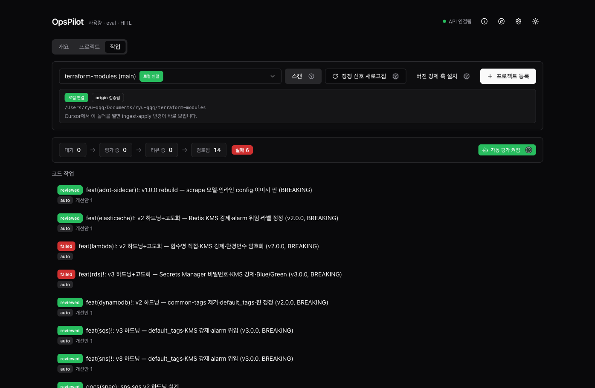
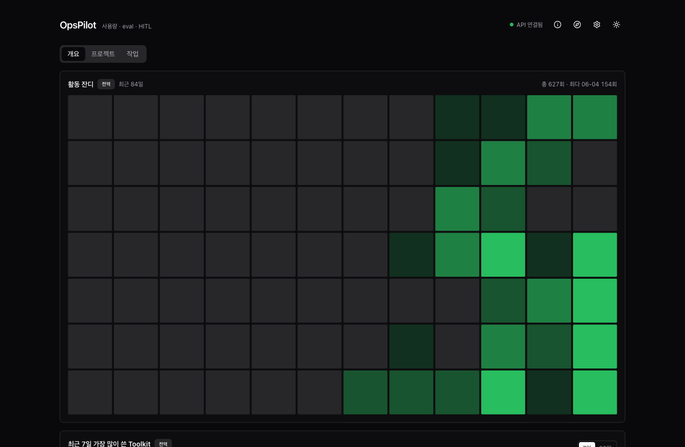
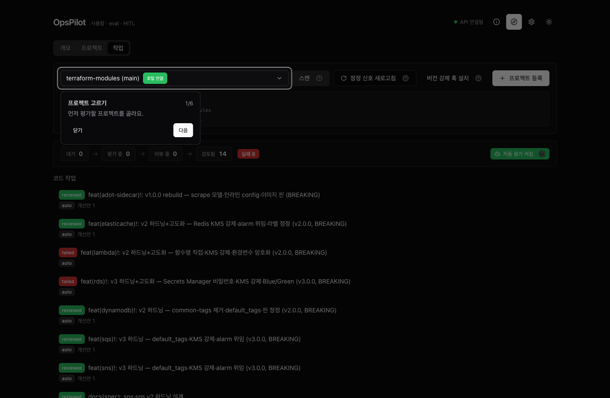

# OpsPilot — Harness Control Plane

> Claude Code 에이전트·스킬·커맨드를 **저작 · 버저닝 · 격리 실행 · 평가 · 채택**하는 로컬 컨트롤 플레인.

내가 만든 에이전트가 _정말 의도대로, 일관되게_ 작동하는지 — 느낌이 아니라 **트레이스와 점수**로 빠르게 판단하기 위한 도구.



---

## 왜 만들었나

조직 위키 _「Software 3.0 시대, Harness를 통한 조직 생산성 저점 높이기」_ 는 에이전트·스킬·커맨드를 플러그인으로 배포하면 팀 생산성의 저점이 올라간다고 주장한다. 그러나 그 선언문은 두 가지를 **미구현 과제로 남겼다**:

- 플러그인 리뷰 / 버저닝 / 배포 프로세스
- 토큰 효율·에이전트 정확도 모니터링 체계

"자산을 배포하라"고 했지만, _그 자산이 제대로 작동하는지 판단할 도구_ 가 빠져 있었다. **OpsPilot은 그 빠진 컨트롤 플레인이다.**

## 닫힌 루프

보통 에이전트/스킬을 만들 때, 잘 작동하는지는 "느낌"으로 판단하고, 프롬프트를 고치면 이전 버전과 무엇이 달라졌는지 알 수 없다. OpsPilot은 이 루프를 닫는다:

```
저작 → 버저닝 → 격리 실행 → 평가 → 채택
```

1. **저작** — 폼으로 에이전트/스킬/커맨드를 작성. 컨셉 한 줄만 주면 AI가 초안(트리거·도구·본문)을 채운다.
2. **버저닝** — 저장하면 OpsPilot이 _구조화 커밋_ 을 강제한다. git 커밋 하나 = 버전 하나.
3. **격리 실행** — 버전을 일회용 git worktree에서 실행. 클론·원본 레포는 건드리지 않는다.
4. **평가** — 시나리오 성공조건 / 사람 점수·회고 / 머신 스코어러 / LLM 판정 / 버전 비교 / 벤치마크.
5. **채택** — 비교·벤치마크로 가린 버전을 자산의 현재 버전으로 "앞으로 감기"(구조화 커밋).

## 핵심 설계

OpsPilot을 단순 로그 뷰어와 다르게 만드는 네 가지 결정:

| 설계 | 내용 |
| --- | --- |
| **git 커밋 = 버전의 단일 원천** | 별도 버전 DB가 없다. 프로젝트는 **로컬 경로 연결** 또는 **git URL 클론**으로 등록하고, 자산 변경은 구조화 커밋으로 강제한다 — git 히스토리가 곧 버전 히스토리. |
| **worktree 격리 실행** | 실행은 버전 커밋으로 만든 일회용 git worktree에서 일어나고, 끝나면 폐기된다. 클론·원본 레포는 오염되지 않는다. |
| **비동기 러너** | 실행 요청은 즉시 반환되고 백그라운드에서 진행되며 프론트가 폴링한다. 수 분~수십 분 걸리는 실행도 화면을 막지 않는다. |
| **로컬 `claude` CLI 직접 실행** | 별도 API 키·과금 없이 로컬 `claude` 헤드리스를 spawn한다(키체인 인증 직결). 글로벌 MCP는 차단해 실행의 재현성을 확보한다. |

## 무엇을 보는가 — 3탭

UI는 세 탭이다.

| 탭 | 한 줄 | 무엇을 하나 |
| --- | --- | --- |
| **개요** | 한눈에 현황 | 활동 잔디 · 자주 쓴 toolkit · 자산 헬스 |
| **프로젝트** | 레지스트리 · 저작 · 실험 | 등록 · 스캔 · 자산 작성 · 버전 × 시나리오 실행 · 비교 · 벤치마크 · 채택 |
| **작업** | 평가·개선의 중심 | Cursor·AI 작업이 자동 평가돼 쌓이고, 하나를 열면 판정→개선안→증거가 한 화면에 |

### 개요 — 한눈에 현황

활동 잔디(언제 얼마나 돌렸나) · 최근 자주 쓴 toolkit · 프로젝트 자산 헬스를 한 화면에.



### 프로젝트 — 레지스트리 · 저작 · 실험

프로젝트의 자산(에이전트·스킬·커맨드)을 목록·상태(문제·미사용)로 보고, 각 자산의 git 버전 타임라인·prune을 다룬다. 여기서 자산을 작성하고 버전 × 시나리오를 실행·비교·채택한다.


### 작업 — "잘했나 / 뭘 고치나"를 한 흐름으로

원래 피드백(결정)과 실행/트레이스(증거)는 같은 파이프라인의 두 단면인데 화면이 갈라져 있었다. OpsPilot은 이를 **작업 한 탭**으로 합쳤다. 작업 목록(코드 작업 · 수동 실행)에서 하나를 고르면, 전체폭 드릴다운으로 **판정 → 개선안 결정**이 항상 보이고, 처리 단계·평가·실행 과정(트레이스)·검토·변경 diff는 펼쳐서 파고든다 — **결론 먼저, 증거는 필요할 때.**


## 평가

정답이 있는 작업과 없는 작업을 모두 다루는 다축 평가:

- **시나리오 성공조건** — 시나리오 셋으로 통과/실패 자동 채점(회귀 테스트).
- **사람 점수 · 회고 메모** — 숫자 외에 "왜"를 자유 서술해 지식이 되게.
- **머신 스코어러** — 시나리오의 성공조건을 인식해 자동으로 판정하는 judge(기준-인식). 3-state 게이트로 "기준 없음"을 정직하게 구분.
- **LLM-as-judge** — 표면 준수·assertion 변별력을 기준 기반으로 비평.

여기에 **벤치마크**(같은 버전×시나리오를 N회 반복 → 통과율·표준편차로 _일관성_ 측정), **버전 A·B 비교**(같은 시나리오로 여러 버전 동시 실행, 컬럼별 나란히), **실행 트레이스**(도구 호출·위임·토큰의 단계별 리스트 + 흐름 그래프), **변경 diff**(worktree에서 에이전트가 실제 만진 파일)가 더해진다.

## 온보딩 가이드 투어

처음 쓰는 사람을 위해, 헤더의 **나침반 토글**을 켜면 첫 사용 핵심 경로(프로젝트 선택 → 스캔 → 작업 → 판정 → 개선안)를 **스포트라이트 + 말풍선**으로 6단계 안내한다. 탭·상세가 단계에 맞춰 자동 전환된다. 의존성 없는 자체 구현.



## Cursor 피드백 루프

일상 루프는 Cursor·AI 작업을 그대로 평가 대상으로 삼는다 — 일을 두 번 하지 않는다.

```
Cursor·AI 작업 → commit
    ↓  ingest (MCP ingest_cursor_session 또는 자동 ingest)
작업 — eval(work-evaluator) → review(proposal-reviewer)
    ↓  개선안(draft) → 사람 승인/거절(HITL)
승인 시 등록 경로에 반영(git 커밋) → 다음 세션의 기준
```

자세한 설정(agent-crew sync · 두 모드 · MCP 13툴)은 → **[온보딩 가이드](docs/consumer-onboarding.md)**.

## 스택

pnpm workspace 모노레포:

| 워크스페이스 | 스택 |
| --- | --- |
| `apps/web` | Vite + React + TypeScript — TanStack Query, shadcn/ui + Tailwind, React Flow |
| `apps/server` | Fastify + TypeScript + better-sqlite3 |
| `packages/config` · `packages/shared-types` | 공유 ESLint/TS 설정, 공유 Zod 스키마 |

- **러너** — 로컬 `claude` CLI 헤드리스 spawn (별도 키·과금 없음)
- **런타임** — Node ≥ 20, `corepack pnpm`

코드 컨벤션은 [`CONVENTIONS.md`](./CONVENTIONS.md)(토스 Frontend Fundamentals 4원칙 기반), 데이터 모델은 [`docs/DATA_MODEL.md`](./docs/DATA_MODEL.md). 작업 추적은 Notion **Engineering OS**.

## 빠른 시작

전제: Node ≥ 20, `corepack`(pnpm), (러너·초안 자동생성·MCP용) 로컬 `claude` CLI.

```bash
./scripts/bootstrap.sh
```

전제조건 점검 → `pnpm install` → `db:migrate`(영속 DB면 자동 백업) → 데몬(:3001)·프론트(:5173) 기동 → `claude mcp add`까지 **멱등**하게 처리한다. 브라우저로 `http://localhost:5173` 접속 후, 헤더 나침반(가이드 투어)을 켜서 따라가면 된다.

손으로 띄우려면:

```bash
corepack pnpm install
cd apps/server && corepack pnpm db:migrate && corepack pnpm dev   # → :3001
cd apps/web && corepack pnpm dev                                  # → :5173
```

Claude Code 세션에서 OpsPilot 툴을 쓰려면 MCP 한 줄 등록:

```bash
claude mcp add --transport http opspilot http://localhost:3001/mcp
```

→ 툴 표·프로젝트 적용은 [온보딩 가이드](docs/consumer-onboarding.md).

## 현재 상태와 한계

v1 핵심 완료 — 저작 · 버저닝 · 격리 실행 · 비동기 러너 · 평가(시나리오 성공조건 / 사람 점수·회고 / 머신 스코어러 / LLM judge) · 버전 비교 · 회귀 · 벤치마크 · 채택 · 트레이스 관측 · 변경 diff · 작업 통합 뷰 · 온보딩 투어 · AI 트레이스 분석 · 지라/노션 import · MCP 어댑터.

**정직한 한계:**

- **이식** — 검증된 버전을 _다른 프로젝트_ 로 옮기는 기능은 미구현. 현재 채택은 같은 자산의 "앞으로 감기"까지. 중앙 라이브러리 → 소비 프로젝트 배포가 다음 단계.
- **플라이휠** — 사람 점수·회고를 _더 나은 프롬프트 추천_ 으로 환류하는 고리는 미구현. 현재는 저장·축적까지(그게 환류의 연료다).
- **OSS 원스톱 설치** — MCP 등록은 한 줄로 되지만, _클린 머신_ 에서 npm 한 줄 설치(prebuilt better-sqlite3 포함)는 미구현. 현재는 레포를 클론해 직접 기동한다.
- 로컬 Claude Code 사용 환경을 대상으로 한다. Agent SDK·클라우드 실행은 후순위.
