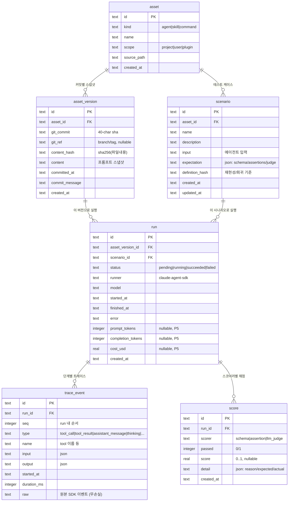

# OpsPilot 데이터 모델 (OPSP-2)

레지스트리·평가·버저닝의 단일 기반. **git 커밋 = 버전의 단일 원천.**

## ERD

## 엔티티

| 엔티티 | 무엇 | 핵심 제약 |
|---|---|---|
| **asset** | 평가 대상 = Claude Code agent/skill/command | `UNIQUE(kind,name,scope)` |
| **asset_version** | 특정 git 커밋 시점의 자산 스냅샷 (불변) | `UNIQUE(asset_id,git_commit)` |
| **scenario** | 자산에 대한 테스트 케이스(입력+기대) | `UNIQUE(asset_id,name)` |
| **run** | (asset_version × scenario) 1회 실행 = 분기점 | FK 인덱스, status 인덱스 |
| **trace_event** | run의 단계별 정규화 트레이스 + 원본 보관 | `UNIQUE(run_id,seq)` |
| **score** | run 채점 결과 (스코어러별 N개) | `run_id` 인덱스 |

## 설계 근거 (CONVENTIONS.md 결합도/응집도 반영)

1. **git_commit = 버전 원천**: `asset_version`은 `(asset_id, git_commit)`로 유일한 불변 스냅샷.
   같은 커밋 재스캔은 멱등(중복 삽입 무시). 별도 버전 DB를 만들지 않는다.
2. **run = 분기점**: 어떤 *버전*을 어떤 *시나리오*로 돌렸나의 교차점.
   → P3 A·B diff = 같은 scenario를 두 asset_version으로 돌린 run 비교, 스키마 변경 0.
3. **trace_event는 정규화 필드 + `raw` 동시 보관**: 뷰어(OPSP-7)는 정규화 필드로,
   토큰 패널(P5)·재처리는 `raw`에서 파싱. 무손실 → 미래 요구를 스키마 변경 없이 흡수.
4. **score는 run에 1—N**: scorer 판별 컬럼 하나로 schema/assertion/llm_judge 수용.
   스코어러별 테이블 분리(섣부른 추상화) 안 함 — 결합도 원칙.
5. **시나리오 버저닝은 `definition_hash`로 경량 처리**: 회귀 재현 기준만 확보.
   전용 scenario_version 테이블은 YAGNI(필요 시 후속 승격).
6. **배치/스위트(P2) 미포함**: 향후 `run.batch_id`(nullable) 추가로 무중단 확장 가능.

## SQLite 규약

- 시각은 전부 ISO8601 UTC `TEXT`. boolean은 `INTEGER` 0/1. ID는 UUID `TEXT`.
- `PRAGMA foreign_keys=ON` (FK 강제), `PRAGMA journal_mode=WAL` (읽기/쓰기 동시성).
- 모든 FK는 `ON DELETE CASCADE` (asset 삭제 시 하위 전부 정리).

DDL 원본은 [`apps/server/src/db/schema.sql`](../apps/server/src/db/schema.sql),
공유 타입/검증 스키마는 [`packages/shared-types/src/domain.ts`](../packages/shared-types/src/domain.ts).
